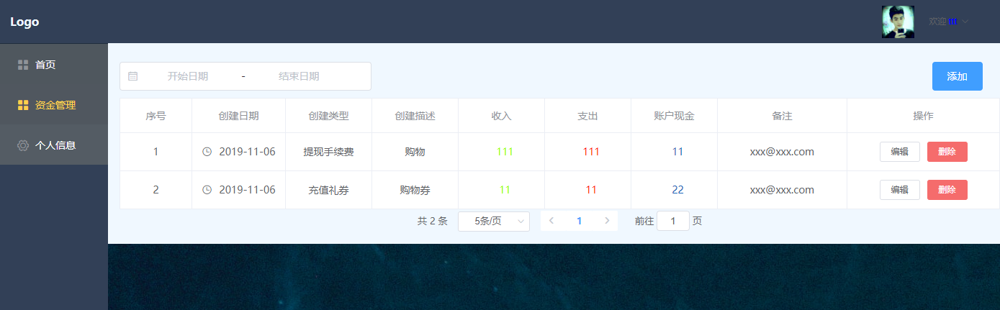
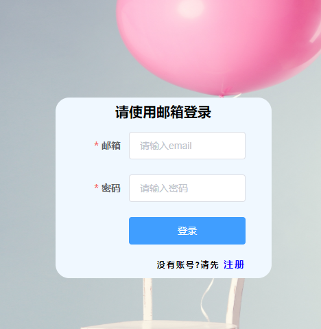
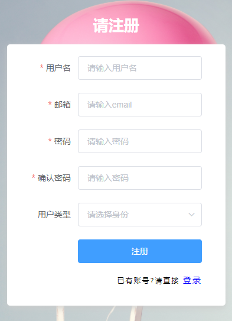

# 管理系统


<div align="center">


</div>

## 服务器: node + express + mongoose
* 基础内容---
## 测试: postman + nodemon

## 加密: bcrypt
* 如果安装不了改用 `bcryptjs`
``` js
    //加密
    bcrypt.genSalt(saltRounds, function(err, salt) {
    bcrypt.hash(myPlaintextPassword, salt, function(err, hash) {
        // Store hash in your password DB.
        });
    });
    //验证
    bcrypt.compare(myPlaintextPassword, hash, function(err, res) {
        // res == true
    });
```
[npm](https://www.npmjs.com/package/bcrypt)

## 验证:  jsonwebtoken + passport + passport-jwt
   ``` JS
   const jwt = require('jsonwebtoken')
     // jwt.sign("规则", "加密名字", "过期时间", "箭头函数")
    jwt.sign(rule, config.secret, { expiresIn: 3600 }, (err, token) => {
            res.json({
                success: true,
                token: "Bearer " + token
            })
        })
   ```
   会返回一个token用于之后验证
   ``` js
    // server.js 初始化
    const passport = require("passport")
    app.use(passport.initialize())
    require("./parts/passport")(passport)
   ```
   ``` js
    // passport.js
    const JwtStrategy = require('passport-jwt').Strategy,
    ExtractJwt = require('passport-jwt').ExtractJwt;
    const User = require("./db/db_user")
    const keys = require("./config").secret
    const opts = {}
    opts.jwtFromRequest = ExtractJwt.fromAuthHeaderAsBearerToken()
    opts.secretOrKey = keys
    module.exports = passport => {
        passport.use(new JwtStrategy(opts, (jwt_payload, done) => {
            console.log(jwt_payload)// 返回 jwt rule {id,name,iat,exp}
            User.findById(jwt_payload.id)
                .then(user => {
                    if (user) {
                        return done(null, user)
                    }
                    return done(null, false)
                })
                .catch(err => console.log(err))
        }));
    }
   ```
   ```js
   //get接收  请求必须带 key:Authorization value: "Bearer " + token 返回的内容
   //否则 返回 "Unauthorized" 错误
   router.get("/current", passport.authenticate("jwt", { session: false }), (req, res) => {
    res.json(req.user) // 接收 passport done回调返回的 user 
        // res.json({ msg: "success" })
    })
   ```
## 头像: gravatar
* mongoose userSchema 
``` js
     avatar: {
        type: String
    }
     let avatar = gravatar.url(req.body.email, { s: '200', r: 'pg', d: 'mm' });
```
可以连接GitHub头像的 [头像设置地址](http://cn.gravatar.com/)


## 客户端 

### 解析token
* `import jwt from "jwt-decode";`
* `let decode = jwt(token)let decode = jwt(token)`


### vuex
```js
const state = {
    isAuthenticated: false,
    user: {},
    FORM_DATA: []
}
```

### 请求头
```js
//请求拦截//设置统一请求头
axios.interceptors.request.use(config => {
    startLoading();
    if (localStorage.token) {
        
        config.headers.Authorization = localStorage.token
    }
    return config;
}, error => { return Promise.reject(error) })
```
### 路由守卫
```js
router.beforeEach((to, from, next) => {
    let isLogin = localStorage.getItem("token") ? true : false;
    if (to.path == "/login" || to.path == '/register') {
        next()
    } else {
        isLogin ? next() : next("/login")
    }
})
```
